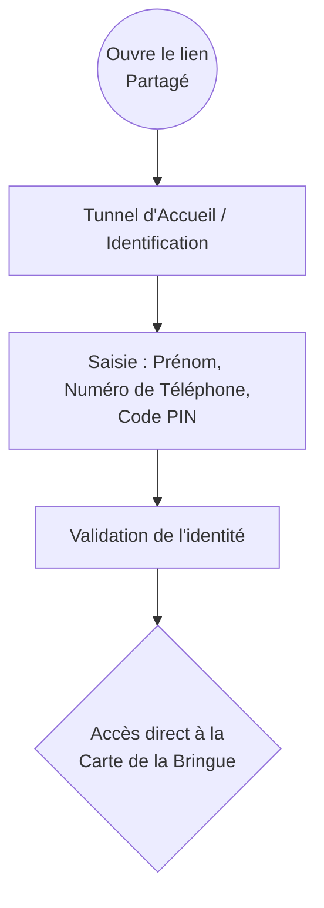
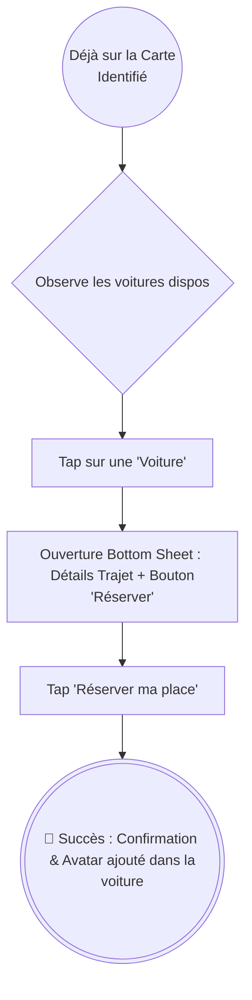
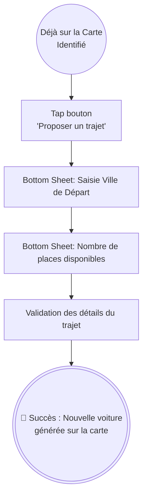

# UX Design Specification: VendiBringue Covoit'

This document defines the user experience, emotional design, and visual foundations for the VendiBringue carpooling PWA.

<!-- UX design content will be appended sequentially through collaborative workflow steps -->

## Phase 3: Core Experience & Principles

### Defining Experience
L'expérience cœur repose sur la **"Mise en relation instantanée"**. Le succès dépend de la facilité avec laquelle un Pilote peut proposer ses places et la clarté avec laquelle un Passager peut suivre son arrivée en temps réel sur la carte.

### Platform Strategy
**PWA (Progressive Web App) Mobile-First** : 
*   **Géolocalisation API** : Suivi haute précision pour le Pilote en mouvement.
*   **Web Push API** : Notifications critiques pour les passagers (approche du véhicule, confirmation de place).
*   **Touch-Optimized** : Interface pensée pour une utilisation rapide, à une main, dans des contextes festifs.

### Experience Principles
1.  **Pilote-First Friction** : Créer un trajet doit être aussi simple que d'envoyer un message.
2.  **Visual Pulse** : Privilégier le retour visuel immédiat (animations, statuts colorés) sur la densité d'information.
3.  **Ubiquitous Alerts** : Utiliser les notifications push pour maintenir le lien sans forcer l'utilisateur à garder l'appli ouverte.

---

## Phase 4: Desired Emotional Response

### Primary Emotional Goals
*   **Chaleur Sociale & Communauté** : L'application doit respirer l'accueil, s'éloignant du côté transactionnel d'Uber pour embrasser l'esprit de "famille" de la Bringue.
*   **Excitation Festive** : Transformer l'organisation logistique en une extension de la fête.
*   **Confiance & Sécurité** : Éliminer l'anxiété grâce à une fiabilité exemplaire des données temps réel.

### Emotional Design Principles
1.  **L'Appli Complice** : Anticiper les besoins sans être intrusive.
2.  **Transparence Humaine** : Prioriser les avatars et les noms sur les identifiants ou numéros de voiture.
3.  **Zéro Jargon** : Communiquer comme on le ferait de vive voix lors d'une fête.

---

## Phase 5: UX Pattern Analysis & Inspiration

### Inspiring Products Analysis
*   **Snapchat (Zenly)** : Maîtrise de la "Carte Sociale". L'inspiration vient de la fluidité des marqueurs et du sentiment de présence. Finding friends should be visual and live.
*   **Instagram** : Concept de "Glanceable Stories". Utiliser des avatars ronds et des transitions fluides pour montrer qui est à bord, humanisant ainsi les données.
*   **Lydia** : "Radical Efficiency". Réserver ou valider une action doit être aussi simple et gratifiant qu'un paiement Lydia (Gros boutons, retours visuels "Wow").
*   **Tricount** : Transparence de groupe. Visibilité partagée des ressources (places de voiture) pour que tout le monde soit au même niveau d'information.

### Design Inspiration Strategy
*   **Adopter** : Le bouton flottant (FAB) de Lydia pour les actions principales.
*   **Adapter** : Le système de navigation horizontale (carrousel) d'Instagram pour défiler entre les trajets disponibles.
*   **Éviter** : Les listes de trajets denses et textuelles. Prioriser la vue Map + Cartes de détails.

---

## Design System Foundation

### 1.1 Design System Choice
**Système Hybride (Tailwind CSS sur mesure)**. 

### Rationale for Selection
*   **Expertise Utilisateur** : Thomas est familier avec Tailwind, ce qui facilite la maintenance et les itérations rapides.
*   **Balance Wow/Vitesse** : Permet une identité visuelle unique (tokens Heritage Bringue) tout en profitant de la robustesse des utilitaires de mise en page.
*   **Performance PWA** : Tailwind garantit un poids CSS minimal, crucial pour une application mobile fluide.

### Implementation Approach
*   **Configuration Tailwind** : Mise en place d'un `tailwind.config.js` étendu avec les jetons spécifiques au projet.
*   **Stitch Integration** : Utilisation des outils Stitch pour pré-configurer les échelles de couleurs et d'espacement.

### Customization Strategy
*   **Palette de Couleurs** : Intégration de la charte "Airbnb Premium" (Vert Forêt profond, blanc cassé).
*   **Radii (Arrondis)** : Utilisation d'arrondis généreux (`rounded-xl` / 12px) et pill (`rounded-full`) pour les boutons.
*   **Typographie** : Utilisation exclusive de **Inter** pour tous les niveaux (titres, corps, labels) afin de garantir une cohérence maximale et une lisibilité "App native".

---

## 2. Core User Experience

### 2.1 Defining Experience
**"The Convergence Map" (La Carte de Convergence)** : L'effet "Wow" ne réside pas dans le suivi millimétré d'un seul véhicule, mais dans l'impact visuel de voir tous les covoiturages converger vers un point central unique : l'épicentre de la soirée. C'est l'esthétique du mouvement collectif.

### 2.2 User Mental Model
Le public cible (des invités à une soirée, pas nécessairement un cercle d'amis proches) cherche une coordination pragmatique. Le modèle mental est celui d'une communauté liée par un événement commun : "Qui part d'où et où reste-t-il de la place ?". L'expérience doit être un outil logistique simple, habillé d'une interface sexy et dynamique.

### 2.3 Success Criteria
*   **Vue d'Ensemble Instantanée** : En ouvrant l'app, l'utilisateur ressent l'ampleur de l'événement et voit le flux des participants vers la fête.
*   **Lisibilité des Places** : L'état d'une voiture (Complète vs Places dispo) est visuellement évident sur la carte sans aucune action de l'utilisateur.
*   **Focus sur l'Événement** : La carte met naturellement l'épicentre (la soirée) en valeur.

### 2.4 Novel UX Patterns
**L'Épicentre Fixe** : Contrairement aux apps VTC classiques de point A vers point B aléatoires, tous les trajets pointent vers la même adresse de destination. L'interface cartographique tire parti de cette particularité avec des lignes de convergence ou une orientation commune des marqueurs vers le centre.

### 2.5 Experience Mechanics
*   **1. Initiation** : À l'entrée dans l'app, la caméra est centrée sur l'Épicentre (la fête), dévoilant la carte avec toutes les voitures en route ou programmées.
*   **2. Interaction** : L'utilisateur explore la carte d'un simple balayage. Les voitures disponibles ont un marqueur distinctif (ex: icône brillante ou badge de place). Un clic dessus ouvre une "bottom sheet" (panneau du bas) avec des infos claires et un gros bouton de réservation.
*   **3. Feedback** : Lorsqu'une voiture est sélectionnée, on voit visuellement son tracé prévu jusqu'à l'épicentre.
*   **4. Completion** : Lorsqu'un utilisateur réserve, son avatar apparaît dans la voiture, et le statut global sur la carte se met à jour pour tous les autres invités en temps réel.

---

## 3. Visual Design Foundation

### 3.1 Color System
**Thème "Airbnb Premium" (Deep Forest & Pearl)**
*   **Mode Clair (Par défaut)** : Un fond blanc cassé / perle (`#fcf9f8`) pour un rendu haut de gamme et reposant.
*   **Mode Sombre** : Déclinaison sur des gris anthracite profonds avec des accents verts.
*   **La Palette (Vert Forêt)** :
    *   *Vert Primaire* (`#006A45`) : Couleur signature utilisée pour l'identité, les marqueurs actifs et les boutons principaux.
    *   *Vert Secondaire* (`#056c47`) : Pour les états de survol et les éléments interactifs secondaires.
    *   *Surfaces* (`#f0eded`) : Gris-beige très léger pour les conteneurs (Bottom Sheets, Inputs).
    *   *Texte sur Surface* (`#1b1c1c`) : Noir mat pour un contraste optimal.

### 3.2 Typography System
**"Sobriété Native" (Inter Everywhere)**
*   **Titres & UI** : Utilisation de la police **Inter** (wght 600+) pour les titres, avec un interlettrage `tracking-tight` pour un look moderne.
*   **Corps de texte** : **Inter** (wght 400/500) pour tout le contenu utilitaire.

### 3.3 Spacing & Layout Foundation
**"Soft & Friendly" (Chaleureux et Arrondi)**
*   **Radii (Bords Arrondis)** : Utilisation de coins très généreux sur les cartes et les boutons (`rounded-2xl` à `rounded-3xl` en Tailwind, soit 16px-24px d'arrondi). Pas de bords carrés.
*   **Espacements "Breathable"** : Marges internes (padding) assez larges à l'intérieur des cartes pour que l'information respire.
*   **Ombres Floutées (Soft Shadows)** : Ombres larges, diffuses et légèrement teintées (jamais de noir pur) pour détacher les cartes flottantes par-dessus la map (Glass/Soft UI).

### 3.4 Accessibility Considerations
*   **Contraste Garanti** : Le vert profond sur fond beige assurera une lisibilité parfaite (niveau WCAG AA) en plein jour.
*   **Touch Targets Massives** : "Règle des gros doigts". Boutons et éléments cliquables au minimum 48x48px.

---

## 4. Design Direction Decision

### 4.1 Design Directions Explored
L'exploration s'est concentrée sur des variantes du thème "Heritage Bringue" :
*   *Direction A ("L'Outil Logistique")* : Interface riche en données, très dense, axée en premier sur les listes et les horaires. Écartée car perçue comme trop austère et "corporate".
*   *Direction B ("Le Panneau Communautaire Centré sur la Map")* : Accent sur la vue cartographique immersive, avec de larges cartes (UI cards) claires pour gérer les véhicules. (**Sélectionnée**).

### 4.2 Chosen Direction
**Direction B : "Le Panneau Communautaire Centré sur la Carte" (Map-Centric Social Panel)**.

L'interface s'articule autour de deux couches (layers) distinctes :
1.  **La Couche Fond-de-Plan (La Carte)** : Immersive, en plein écran. Elle sert de fond vivant et rassemble visuellement tous les participants vers l'épicentre.
2.  **La Couche Interactive (La Bottom Sheet & Overlays)** : Panneaux flottants dans les tons clairs (beige/blanc cassé) s'élevant du bas de l'écran, avec des arrondis très larges (24px+) pour la douceur, soutenus par des ombres fluides et diffuses (Glass UI).

### 4.3 Design Rationale
*   **Réduction de la Charge Cognitive** : Les invités n'ont pas l'esprit à remplir des formulaires. La carte offre un contrôle spatial instinctif. La superposition via bottom sheet permet des actions directes sans changer complétement d'écran ("frictionless").
*   **Adéquation Marque** : Le mariage d'un outil de localisation précis avec une esthétique inspirée d'Airbnb apporte une crédibilité instantanée et un sentiment de fiabilité ("Premium Safe") crucial pour le covoiturage.

### 4.4 Implementation Approach & Micro-Interactions
*   **Composant Clé (Bottom Sheet)** : Modale glissante qui remonte du bas de l'écran avec une animation d'adoucissement mathématique "Ease-out", **sans** rebond ni ressort, pour rester sobre tout en glissant naturellement sous le doigt.
*   **Ciblage Dynamique (Focus Mode)** : Un léger grossissement est appliqué à la voiture sélectionnée sur la carte, pendant que le reste des véhicules diminue en opacité afin de centrer l'attention.
*   **Appel à l'action "Wow"** : Un balayage lumineux (effet "Shimmer" Jaune Paille) traverse périodiquement le bouton de réservation principal ("Vert Action") pour attirer délicatement le regard.
*   **Feedback Festif** : L'utilisation de compteurs "vivants" (les chiffres roulent lorsqu'une place est prise/libérée) et d'animations de remplissage visuel de la voiture (les avatars s'installent) pour marquer la conclusion du parcours d'une façon satisfaisante.

---

## 5. User Journey Flows

### 5.1 L'Entrée Commune (Le Tunnel d'Identification)
Dès l'ouverture de l'application, l'utilisateur fait face au mur d'identification sécurisé de la soirée. Afin de conserver un modèle 100% gratuit et sans friction, aucune vérification SMS n'est effectuée (système basé sur la confiance entre invités). Aucun contenu n'est visible avant validation du PIN.

### 5.2 Le Parcours Passager (Réserver une place)
Une fois identifié sur la carte, le parcours de réservation ne demande plus la moindre saisie au clavier. La gestion des conflits (deux clics simultanés) est gérée par un simple message d'erreur gracieux ("Oups, quelqu'un a été plus rapide").

### 5.3 Le Parcours Conducteur / Sam (Proposer des places)
La création de trajet est extrêmement fluide (le conducteur est déjà identifié). En cas d'annulation totale, le conducteur a accès aux numéros des passagers pour les prévenir manuellement, évitant de développer un système de notifications complexe.

### 5.4 Flow Optimization Principles
*   **Identification Factorisée (Upfront Gate)** : Exiger (Prénom, Tél, PIN) dès le départ simplifie tout le reste de l'expérience (1-Click).
*   **Zero-Friction Inside** : Réserver ou proposer un trajet se limite à des clics interactifs dans la Bottom Sheet.
*   **Low-Tech / High-Trust** : Les annulations et problèmes sont résolus humainement (par appel/SMS grâce à l'accès au numéro des passagers) plutôt que par de l'ingénierie complexe, en adéquation parfaite avec un usage "One-Shot" par an.

---

## 6. Component Strategy

### 6.1 Design System Components (Stitch Foundation)
En utilisant les composants standards, nous couvrons instantanément les "commodités" :
*   **Boutons (FAB, Primary, Text Buttons)** : Utilisés partout, avec une simple application de nos *Design Tokens* (beaucoup d'arrondi, couleur Vert Profond).
*   **Text Fields (Champs de saisie)** : Pour l'écran "Portail" (Prénom, Tél, PIN).
*   **Bottom Sheet (Mécanique)** : Le comportement natif du "tiroir qui monte" sera conservé tel quel.

### 6.2 Custom Components (Spécifiques à Vendibringue)

#### 1. Le "Car Marker" (Marqueur Voiture interactif)
*   **Purpose:** Montrer immédiatement les voitures sur la carte et leur taux de remplissage.
*   **Anatomy:** Une icône de véhicule ou, mieux, l'Avatar stylisé du conducteur (le "Sam"), surmonté d'un badge bulle visuel indiquant les places (ex: "3/4" en Vert ou "PLEIN" en Gris).
*   **States:** 
    *   *Default*: Taille standard, Vert.
    *   *Selected (Focus Mode)*: S'agrandit, déclenche l'ouverture de la Bottom sheet.
    *   *Full (Plein)*: Opacité à 50%, non-cliquable (ou cliquable juste pour info).

#### 2. Le "Huge Spot Counter" (Sélecteur de places)
*   **Purpose:** Remplacer un menu déroulant ou un clavier numérique par une interaction tactile pure, beaucoup plus agréable quand on tient son téléphone d'une main.
*   **Anatomy:** Un immense chiffre très gras au centre, entouré par deux gros boutons circulaires flottants `[ - ]` et `[ + ]`.
*   **Interaction:** Chaque appui sur +/- fait "rouler" le chiffre avec un effet physique (Spring).

#### 3. L' "Auth Gate Card" (Carte d'Accès Frontale)
*   **Purpose:** Panneau principal bloquant le parcours au lancement (voir Étape 10).
*   **Anatomy:** Panneau centré avec ombre douce (Surface claire). Contient un header (Logo/Titre), les 3 champs de sécurité, et le bouton de soumission pleine largeur ("Rejoindre la Bringue").

### 6.3 Component Implementation Strategy
*   **Touch Targets Massifs** : Aucun bouton ou contrôle Custom Component (comme le +/-) ne fera moins de 64x64px. Le principe du "Gros Doigt" est la règle d'or de notre architecture UI.
*   **Economie de Modalités** : En dehors du Portail d'Entrée et des alertes d'erreur ("Oups Trop Tard"), *toutes* les interactions de l'application logeront dans un seul composant dynamique : la Bottom Sheet sur la carte.

### 6.4 Implementation Roadmap
*   **Phase 1 - Fondations (Design Tokens & Access Gate)**
    *   Configuration du Design System dans Stitch (Palette, Rayons de courbure).
    *   Création et stylisation de *L'Auth Gate Card*.
*   **Phase 2 - Le Socle Spatial**
    *   La Map Full-screen.
    *   Création et stylisation fine des *Car Markers*.
*   **Phase 3 - La Tour de Contrôle (Interactivité et Micro-animations)**
    *   Intégration du *Huge Spot Counter* dans la Bottom Sheet.
    *   Branchements des animations de validation (Succès = Avatar monte dans la voiture).

---

## 7. UX Consistency Patterns

### 7.1 Button Hierarchy
*   **Bouton Primaire (L'Action Centrale)** : Immense (hauteur min 56px), bords totalement arrondis (Stadium/Pill shape), couleur "Vert Action" (ou la couleur Primaire définie). Utilisé pour les actions vitales ("Rejoindre", "Réserver", "Proposer").
*   **Boutons Flottants (Contrôles Locaux)** : Ronds, très contrastés. Utilisés pour les contrôles sur la carte (Focus, Localisation) ou le sélecteur de places `[ + ]` / `[ - ]`.
*   **Bouton Secondaire / Annulation** : Texte simple (sans fond) ou icône discrète (croix) en gris neutre pour les actions d'abandon (fermer la bottom sheet) afin de ne pas concurrencer l'action principale.

### 7.2 Feedback Patterns
*   **Succès (Success)** : Privilégier le **retour visuel diégétique** (ex: l'avatar qui s'ajoute physiquement dans la voiture, la pastille voiture qui pope sur la carte) plutôt qu'un popup "Félicitations". L'état de l'interface *est* la validation.
*   **Erreur (Error)** : Dans le rare cas d'utilisation concurrente (bousculade sur une place), un Toast court (notification en bas d'écran) avec un ton amical : "Oups, quelqu'un a été plus rapide ⚡". Un très léger tremblement (haptic/shake-effect) peut l'accompagner.
*   **Chargement (Loading)** : Remplacer le "loader / spinner" standard par un effet *Shimmer* (balayage lumineux) sur le bouton qui vient d'être cliqué, afin d'indiquer que l'action est en cours sans figer violemment l'écran.

### 7.3 Form Patterns
*   **Claviers Contextuels** : Déclenchement impératif du clavier "Numérique" (Numpad) pour les champs Téléphone et Code PIN dans l'interface de connexion.
*   **Validation Progressive** : Le bouton de soumission "Rejoindre la Bringue" reste inactif (grisé) tant que les conditions basiques ne sont pas remplies (ex: Prénom non vide, Tél = 10 caractères, PIN = 4 caractères).

### 7.4 Navigation Patterns
*   **Single-Page / Zéro Navigation** : L'expérience est entièrement centrée sur la Carte. Il n'y a pas de menu, ni de barre de navigation (Bottom Navigation Bar) standard.
*   **Overlay-Driven** : La navigation se fait exclusivement par superposition. Appuyer sur un élément ouvre une *Bottom Sheet*. 
*   **Light Dismissal** : Toucher le fond de la carte referme naturellement le tiroir. C'est le seul geste de "Retour" nécessaire.

---

## 8. Responsive Design & Accessibility

### 8.1 Responsive Strategy
*   **Mobile-First Absolu** : Vendibringue est une application "de rue". L'interface mobile est l'expérience de référence.
*   **Desktop & Tablette (Vue Élégie)** : Sur les très grands écrans, la carte s'étend. La Bottom Sheet mobile se transforme pour le confort visuel (soit en popup flottante centrée, soit bloquée en largeur maximale max-width: 400px pour ne pas s'étirer démesurément).

### 8.2 Breakpoint Strategy
*   **Mobile (< 768px)** : Layout 100% natif (Map + Bottom Sheet).
*   **Tablette / Desktop (>= 768px)** : Application de la largeur maximale sur le conteneur du formulaire central et sur les modales, avec ombre portée marquée pour détacher la surcouche de la carte.

### 8.3 Accessibility Strategy
Ciblage niveau WCAG AA minimum, mais avec des principes très orientés sur la "diminution cognitive temporaire" (fatigue/fête) :
*   **Loi du "Gros Doigt" (Touch Targets)** : Aucun bouton interactif ne fera moins de 56x56px. Un utilisateur titubant doit pouvoir taper juste du premier coup.
*   **Haut Contraste Nocturne** : Typographie lisible même avec la luminosité du téléphone baissée à 5% dans le noir total (Contraste 4.5:1 minimum).
*   **Redondance de l'information** : On n'utilise jamais que la couleur pour transmettre une info (utile pour les daltoniens et les mauvaises conditions d'éclairage). Si une voiture est pleine, elle n'est pas juste "grise", elle affiche explicitement le texte "PLEIN".

### 8.4 Testing Strategy
*   **Drunk/Tired Test empirique** : L'interface doit être utilisable d'une seule main (le pouce uniquement), potentiellement en marchant.
*   **Automatisation** : Audits réguliers (Lighthouse, Axe) pour s'assurer que le HTML web respecte la navigation au clavier et les labels pour lecteurs d'écrans.

### 8.5 Implementation Guidelines
*   **Unités Relatives (REM)** : Obligatoire pour la typographie (respect des réglages de grossissement natifs de l'OS).
*   **Safe Areas respectées** : Padding en haut et en bas pour ne pas que les "Dynamic Islands" Apple ou les boutons de navigation Android mangent l'interface.

