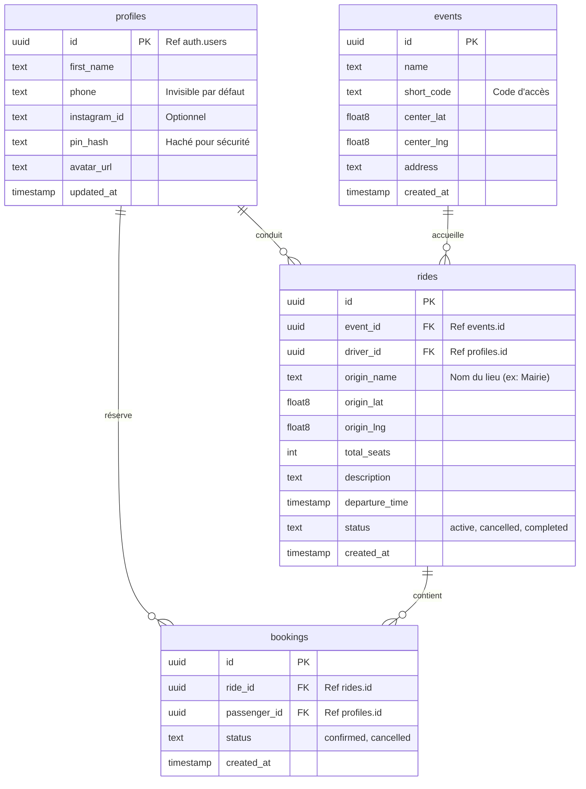

# Database Schema - VendiBringue Covoit'

Ce document définit la structure de la base de données PostgreSQL hébergée sur Supabase.

## Diagramme des Relations (Mermaid)

## Tables de Référence

### `profiles`
Contient l'identité simplifiée des "Bringueurs".
- **Identité** : Liée à `auth.users` de Supabase.
- **Sécurité** : Le numéro de téléphone n'est pas public tant qu'un covoiturage n'est pas validé.

### `rides` (Trajets)
Les offres de covoiturage proposées par les conducteurs.
- `origin_lat/lng` : Points GPS pour l'affichage sur la carte.
- `total_seats` : Maximum de passagers autorisés.

### `bookings` (Réservations)
Jointure entre un passager et un trajet.
- **Contrainte** : Un passager ne peut pas réserver deux fois le même trajet.

## Vues Spéciales
- **`ride_details`** : Calcule automatiquement le nombre de `remaining_seats` en soustrayant les bookings confirmés du total des places.

## Sécurité (RLS)
Des politiques de Row Level Security (RLS) sont actives pour garantir que :
1. Les utilisateurs ne voient les numéros de téléphone que s'ils font partie du même trajet.
2. Seul le conducteur d'un trajet peut le modifier ou l'annuler.
